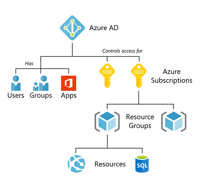
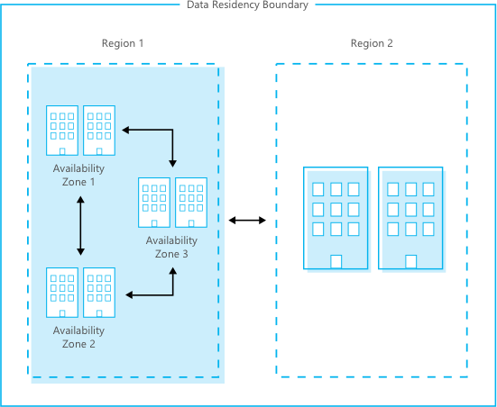

# Azure

### Management

Organizing your cloud-based resources is critical to securing, managing, and tracking the costs related to your workloads. To organize your resources, define a management group hierarchy, follow a well-considered naming convention, and apply resource tagging.

- **Management groups:** These groups are containers that help you manage access, policy, and compliance for multiple subscriptions. All subscriptions in a management group automatically inherit the conditions applied to the management group. You will need this if your organization requires multiple subscription, for example for different groups/services/application.

  [more information](https://docs.microsoft.com/en-us/azure/governance/management-groups/overview)

- **Subscriptions:** A subscription logically associates user accounts and the resources that were created by those user accounts. Each subscription has limits or quotas on the amount of resources you can create and use. Organizations can use subscriptions to manage costs and the resources that are created by users, teams, or projects.

  [more information](https://docs.microsoft.com/en-us/azure/cloud-adoption-framework/decision-guides/subscriptions/)

- **Resource groups:** A resource group is a logical container into which Azure resources like web apps, databases, and storage accounts are deployed and managed.

  [more information](https://docs.microsoft.com/en-us/azure/azure-resource-manager/management/manage-resource-groups-portal)

- **Resources:** Resources are instances of services that you create, like virtual machines, storage, or SQL databases.

**Tags** are useful to quickly identify your resources and resource groups. You apply tags to your Azure resources to logically organize them by categories.

### Access

**Azure Active Directory (Azure AD)** is Microsoft’s cloud-based identity and access management service, which helps your employees sign in and access resources in:

- External resources, such as Microsoft Office 365, the Azure portal, and thousands of other SaaS applications.
- Internal resources, such as apps on your corporate network and intranet, along with any cloud apps developed by your own organization. 

- Each **Subscription** in Azure belongs to only **one Azure AD** (But each Azure AD can control access for more than one subscription)
- Each **Resource Group** belongs to only **one Subscription**
- Each **Resource** belongs to only **one** **Resource Group**

[more information](https://docs.microsoft.com/en-us/azure/active-directory/fundamentals/active-directory-whatis)

### Infrastructure

**Regions**

A region is a set of datacenters deployed within a latency-defined perimeter and connected through a dedicated regional low-latency network.

Regions in Azure adds the flexibility to deploy applications where they need to. Azure is generally available in 53 regions around the world.

[Not every producty is available in all Regions, explore products available by region](https://azure.microsoft.com/en-us/global-infrastructure/services/)

**Geographies**

A geography is a discrete market, typically containing two or more regions, that preserves data residency and compliance boundaries.

Geographies allow specific data-residency and compliance needs to keep data and applications within a specific jurisdiction. Geographies are fault-tolerant to withstand complete region failure through their connection to our dedicated high-capacity networking infrastructure.

[more information](https://azure.microsoft.com/en-us/global-infrastructure/geographies/)

**Availability Zones**

Availability Zones are physically separate locations within an Azure region. Each Availability Zone is made up of one or more datacenters equipped with independent power, cooling, and networking.

Availability Zones allow to run mission-critical applications with high availability and low-latency replication.

[more information](https://azure.microsoft.com/en-us/global-infrastructure/availability-zones/)

